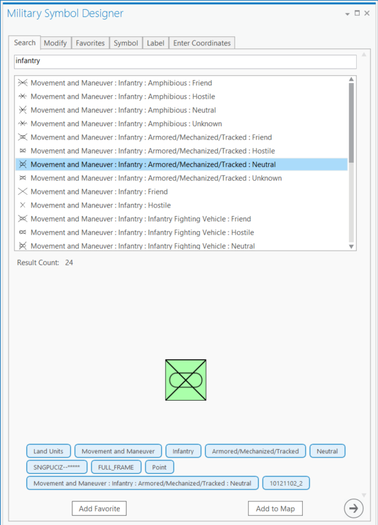

# military-symbol-editor-addin-wpf

A user-focused [ArcGIS Pro](http://pro.arcgis.com) add-in for quickly creating military symbols and overlays using MIL-STD-2525D and MILSTD-2525B Change 2.



## Features

* Addin for ArcGIS Pro
* Quickly and easily search, modify attributes, and preview multilayer military symbols using ArcGIS Pro
* Add created symbols to the map through clicking/drawing or by typing in coordinates
* Save frequently used symbols to Favorites and share these with others

## Sections

* [Requirements](#requirements)
* [Instructions](#instructions)
* [Workflows](#workflows)
* [Resources](#resources)
* [Issues](#issues)
* [Contributing](#contributing)
* [Licensing](#licensing)

## Requirements

### Developers

* Visual Studio 2015
* ArcGIS Pro 2.0+
* ArcGIS Pro 2.0+ SDK

### Users

* ArcGIS Pro 2.0+

## Instructions

### General Help

* [New to Github? Get started here.](http://htmlpreview.github.com/?https://github.com/Esri/esri.github.com/blob/master/help/esri-getting-to-know-github.html)

### Getting Started with the Military Symbol Editor

## Developers

##### Obtain the Dependent Repositories

* Clone this repository
* Clone each of the following component repositories *to the same folder location* 
	* [coordinate-conversion-addin-dotnet](https://github.com/Esri/coordinate-conversion-addin-dotnet)
* Your local folder structure should now look like:

```
{Github Clone Location}
+---coordinate-conversion-addin-dotnet
```

**IMPORTANT NOTE: Because of file name length limitations in Visual Studio, the length of the folder name of {Github Clone Location} should not exceed 80 characters**

* Building
	* To Build Using Visual Studio 2015
		* Open and build solution file
	* To use MSBuild to build the solution
		* Open a Visual Studio Command Prompt: Start Menu | Visual Studio 2015 | Visual Studio Tools | Developer Command Prompt for VS2015
		* `cd military-symbol-editor-addin-wpf\source`
		* `msbuild ProSymbolEditor.sln /property:Configuration=Release`
		* This will build to the location: `source\ProSymbolEditor\bin\Release` and register the add-in
	* Note : Assembly references are based on a default install of the SDK, you may have to update the references if you chose an alternate install location
		* There is a Pro SDK Utilities [Visual Studio Extension](https://visualstudiogallery.msdn.microsoft.com/b3f65b91-9d3b-4ca0-b6bc-4d25c7d51fd1) that can be used to quickly fix Pro SDK assembly references. 
	* To run unit tests from the command prompt:
		* Open a Visual Studio Command Prompt: Start Menu | Visual Studio 2013/2015 | Visual Studio Tools | Developer Command Prompt
		* `cd military-symbol-editor-addin-wpf\source`
		* `vstest.console.exe SymbolEditorUnitTests\bin\Release\SymbolEditorUnitTests.dll /InIsolation /platform:x64`
		    * Note: `vstest` must be used instead of `mstest` in order to run as an `x64` process (required by the Pro SDK dependencies)

## Users

> IMPORTANT: This application depends on the Military Overlay Information Model layer package(LPKX) or Military Overlay geodatabase(GDB) that is provided with the [Military Overlay Information Model Template](http://esriurl.com/MilitaryOverlayInformationModel) or the [Military Overlay Template](http://esriurl.com/AFDMilitaryOverlay). If you do not have the Military Overlay Information Model GDB already included in your project, you will receive a warning and a prompt to add the LPKX when you attempt to use the application.

* Running
	* To run from a stand-alone deployment in ArcGIS Pro:
	* Download and install the add-in. The add-in may be obtained from
		* Included with [Military Tools for ArcGIS](https://esri.github.io/military-tools-desktop-addins)
		* As part of the [Military Overlay Template](http://esriurl.com/AFDMilitaryOverlay) (version 1.1.0+) - 
		* [ArcGIS for Defense Downloads](http://appsforms.esri.com/products/download/#ArcGIS_for_Defense)
        * Install the add-in by double clicking on the downloaded .esriAddinX file in the download
    * Run the add-in
		* Run ArcGIS Pro
		* The ADD-IN appears under the "ADD-IN" tab in Pro
		* Click the "Military Symbol Editor" button and the tool will appear
		* Note: If you do not already have the Military Overlay Information Model/GDB included in your project you will be prompted to add when you use the addin.
			* Click "Yes" at the prompt: "Would you like to add the Military Overlay Layer Package to add the schema to your project?"
		* The Search tab is the first tab:
			* Type a search term into the bar, and click Search (or hit enter)
			* The tool will return matches to that term in the Military style file
			* Selecting a search result will show a preview and associated tags with that symbol
			* Click the next arrow button or the Modify tab when you have selected a symbol
		* The Modify tab is the second tab:
			* Use the select tool in ArcGIS Pro to select already existing features
			* When selected, this will populate a list on this tab
			* Select a feature in this list to start editing it.  The feature's data will be loading into the other tabs for editing.
		* The Favorites tab is the third tab:
			* Users can save a symbol to Favorites that they have previously created so they can easily reuse this symbol
			* The favorites save in a user's account, and show up on this tab
			* Selecting a favorite from the list will load it into the pre-existing workflow.
		* The Symbol tab is the fourth tab:
			* The application will show all symbol display attributes associated with the chosen symbol, with combo boxes for selecting values
			* As you select values, the symbol will update to incorporate those changes
			* A table below has a summary of the values you select
			* After you are finished loading values, click the next arrow or the Text tab
		* The Label tab is the fifth tab:
			* Various values that will be saved into the feature are available for edit here. These values will appear around the symbol on the map.
			* After you are finished populating any text values, you can click the next arrow button to go the last tab.
		* The Enter Coordinates tab is the sixth tab:
			* Coordinates can be entered in DD, DMS, DD, MGRS, or [other coordinate systems] (https://github.com/Esri/coordinate-conversion-addin-dotnet#features).
			* Once valid coordinates are entered, a button can be clicked to add a feature to those coordinates.
		* At any time/tab in this process, the "Add to Map" button, included on every tab, can be clicked to graphically add the feature to the map by clicking.

## Workflows

### Open the add-in in ArcGIS Pro
1. After you've installed the add-in, Open ArcGIS Pro and click the **ADD-IN** tab.
2. Click the **Military Symbol Editor** button.
	The **Military Symbol Editor** pane will open.
	If you don't have the Military Overlay geodatabase in your Pro project, you will be prompted to download or add it.
	The Military Symbol Editor requires this geodatabase.

### Search for a symbol
1. On the **Search** tab, type a keyword in the **Search** box to find the symbol you want (e.g. type "Infantry" to find infantry-related symbols).
2. Optionally, refine your search by typing other keywords (e.g. type "armor" after infantry to find armored infantry symbols).
3. Click one of the results in the list that appears below the search box.
4. Optionally, click **Add to Map** to add the symbol to the map without further refinement.
	You can also modify the symbol before you add it, so it will have the text and graphic modifiers that you want.
5. Optionally, click **Add Favorite** to add the symbol to your favorites list.
	You can also modify the symbol before you add it to your Favorites.
	
### Changing a symbol
1. After you've selected a symbol in the Military Symbol Editor, click the **Symbol** tab.
2. Click the dropdown lists to set the **Identity/Affiliation**, **Status**, **TF, FD, HQ**, **Echelon**, **Context**, **Modifier 1**, and **Modifier 2** modifier attributes.
3. Optionally, click **Add to Map** to add the symbol to the map without further refinement.
4. Optionally, click **Add Favorite** to add the symbol to your favorites list.

### Add text modifiers to a new symbol
1. After you've selected a symbol in the Military Symbol Editor, click the **Label** tab.
2. Click the Date and Time adjustment buttons to set the **Date/Time Valid** and **Date/Time Expired** values for the symbol.
3. Set the **Speed**, **Unique Designation**, **Reinforced**, **Staff Comments**, **Additional Information**, and **Higher Formation** text modifier attributes.
4. Optionally, click **Add to Map** to add the symbol to the map.
5. Optionally, click **Add Favorite** to add the symbol to your favorites list.

### Add a symbol to the map by clicking on the map.
1. After you've selected a symbol in the Military Symbol Editor, click **Add to Map** to add the symbol to the map.
2. Click the location on the map where you want to add the symbol.
    If the symbol is for a point feature, the feature is added where you clicked. If the symbol is for a line or area feature, the first vertex is added.
	Click to add additional vertices. Double-click to finish the feature.
3. Optionally, click elsewhere on the map to add more instances of the symbol.

### Add a symbol to the map by entering coordinates
1. After you've selected a symbol in the Military Symbol Editor, click the **Enter Coordinates** tab to add the symbol at a particular coordinate location.
    **Note:**  The Coordinates box accepts coordinates in a variety of formats, including DD, DMS, MGRS, and UTM. 
2. Type or paste a coordinate value in the Coordinates box.
    If the symbol is for a line or area feature, press the **Enter** key and continue adding coordinates.
3. Click **Add Coordinates to Map**.
    The symbol is added to the map at the coordinates you specified.

### Add a symbol to your Favorites
1. After you've selected a symbol in the Military Symbol Editor, click the **Add Favorite** button.
2. Click the **Favorites** tab.
    You should see the symbol in the favorites box.
3. Optionally, define other symbols that you will need. Add each one to your Favorites.
    Click a symbol in your favorites to add it to the map.

### Sharing Favorites
1. To share or save a set of favorites use the "Save As..." and "Import..." buttons on the Favorites tab
2. Additional information about favorites: 
    1. You may copy, import/export, or share favorites files (ex. `SymbolFavorites.json`) between machines **with the same version of the Military Symbol Editor installed**
    2. Manually editing or creating favorites files outside of the add-in is not generally supported
        1. This file must match the JSON format/model of the current add-in.
        2. This format/model is JSON-serialized from [this class](./source/ProSymbolEditor/Models/SymbolAttributes/SymbolAttributeSet.cs).
    3. The default favorites file used by the application is: `SymbolFavorites.json`
        1. This file is stored with the add-in at the add-in install location (Note: you may copy/paste this path into File Explorer) at:
        2. Military Symbol Editor Add-in: `%LOCALAPPDATA%\ESRI\ArcGISPro\AssemblyCache\{4ff462b0-2910-47f3-b6fd-d1d17e5f7dfc}`
        3. Military Tools for ArcGIS Add-in: `%LOCALAPPDATA%\ESRI\ArcGISPro\AssemblyCache\{bea7f059-c69e-4e17-84bd-072236629c0c}`

### Edit the symbol for a military feature that is already on the map
1. Click the **Modify** tab in the Military Symbol Editor.
2. Activate the select tool on the Modify pane.
3. On the map, select the military feature that you want to change with the select tool.
4. Click the appropriate feature in the list on this tab.
5. The feature's attribute data will load into the **Symbol** and **Label** tabs for editing.
6. Click the Save Edits button to write the edits back to the feature.

## Resources

* [Military Tools for ArcGIS](http://solutions.arcgis.com/defense/help/military-tools/)
* [ArcGIS for Defense Downloads](http://appsforms.esri.com/products/download/#ArcGIS_for_Defense)
* [ArcGIS Solutions Website](http://solutions.arcgis.com/military/)
* [Military Overlay Template](http://esriurl.com/AFDMilitaryOverlay)
* [Military Overlay Information Model Template](http://esriurl.com/MilitaryOverlayInformationModel)
* [ArcGIS Pro Help](http://pro.arcgis.com/en/pro-app/)
* [ArcGIS Blog](http://blogs.esri.com/esri/arcgis/)
* [@EsriDefense](http://twitter.com/EsriDefense)

## Issues

Find a bug or want to request a new feature?  Please let us know by submitting an [issue](https://github.com/ArcGIS/military-symbol-editor-addin-wpf/issues).

> Please note: if you have an issue that is not specifically related to the User Interface or the add-in form itself, but is related to how the symbol draws on the map (ex. incorrect symbol, missing labels on map, line styles) please log those issues against the symbol data itself at: https://github.com/Esri/military-features-data 	

## Contributing

Anyone and everyone is welcome to contribute. Please see our [guidelines for contributing](https://github.com/esri/contributing).

### Repository Points of Contact

##### Primary - [Chris](https://github.com/csmoore)

* Merge Pull Requests
* Creates Releases and Tags
* Manages Milestones
* Manages and Assigns Issues

##### Secondary: [Kevin](https://github.com/kgonzago)

* Backup when the Owner is away

## Credits

This addin uses the following third-party software.

This software is governed by [the Apache V2 License](http://www.apache.org/licenses/LICENSE-2.0):

* Military Features Data - .stylx file and symbol data - https://github.com/Esri/military-features-data
* Coordinate Conversion Addin - Coordinate Conversion library - https://github.com/Esri/coordinate-conversion-addin-dotnet

This software is governed by [the Microsoft Public License (Ms-PL)](http://wpftoolkit.codeplex.com/license):

* Extended WPF Toolkit Community Edition - http://wpftoolkit.codeplex.com

## Licensing

Copyright 2016-2017 Esri

Licensed under the Apache License, Version 2.0 (the "License");
you may not use this file except in compliance with the License.
You may obtain a copy of the License at

   http://www.apache.org/licenses/LICENSE-2.0

Unless required by applicable law or agreed to in writing, software
distributed under the License is distributed on an "AS IS" BASIS,
WITHOUT WARRANTIES OR CONDITIONS OF ANY KIND, either express or implied.
See the License for the specific language governing permissions and
limitations under the License.

A copy of the license is available in the repository's [license.txt](license.txt) file.

[](Esri Tags: Military Analyst Defense ArcGIS ArcObjects .NET WPF ArcGISSolutions ArcMap ArcPro Add-In Symbol Editor Military-Tools-for-ArcGIS)
[](Esri Language: C-Sharp) 
